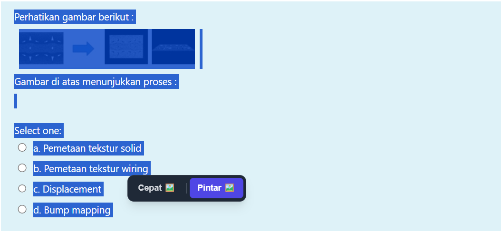
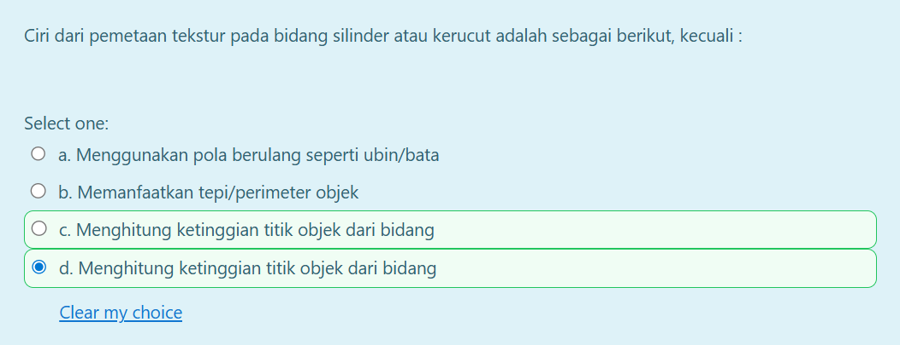
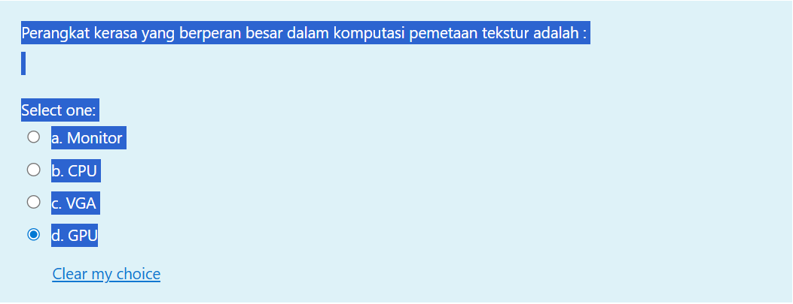
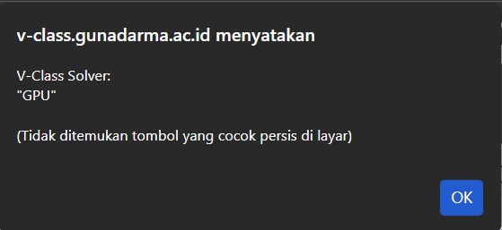

# V-Class Auto Solver

V-Class Auto Solver adalah ekstensi browser yang dirancang untuk membantu mahasiswa menganalisis soal pilihan ganda pada platform V-Class Gunadarma secara efisien menggunakan teknologi kecerdasan buatan (AI) dari Google Gemini. Ekstensi ini mendukung analisis teks maupun soal visual (gambar) dan dapat mengeksekusi jawaban secara otomatis.

---

## Disclaimer & Batasan Tanggung Jawab

Harap perhatikan poin-poin penting berikut sebelum menggunakan alat ini:

1.  **Keterbatasan AI:** Alat ini menggunakan *Large Language Model* (LLM) yang memiliki kemungkinan untuk melakukan kesalahan, halusinasi, atau memberikan jawaban yang tidak akurat. Hasil analisis AI **tidak menjamin kebenaran 100%**. Pengguna disarankan untuk selalu memverifikasi jawaban dengan pengetahuan pribadi atau referensi pembelajaran dari dosen.
2.  **Tujuan Edukasi:** Proyek ini dikembangkan murni untuk tujuan edukasi dalam pemrograman dan riset AI. Alat ini tidak dimaksudkan untuk digunakan sebagai sarana kecurangan (*cheating*) dalam ujian akademik.
3.  **Tanggung Jawab Pengguna:** Pengembang tidak bertanggung jawab atas segala konsekuensi yang timbul akibat penggunaan alat ini, termasuk pada sanksi akademik, pelanggaran kode etik institusi, atau kesalahan nilai akibat jawaban AI yang tidak tepat. Pengguna diharapkan menggunakan alat ini secara bijak, etis, dan bertanggung jawab.

---

## Fitur Utama

1.  **Mode Cepat (Flash):** Menggunakan model `Gemini 2.0 Flash-Lite` untuk menjawab soal berbasis teks pendek dengan respon instan.
2.  **Mode Pintar (Pro):** Menggunakan model `Gemini 2.0 Flash` standar untuk analisis mendalam, sangat direkomendasikan untuk soal hitungan kompleks atau soal yang mengandung gambar.
3.  **Multimodal Vision:** Secara otomatis mendeteksi dan menganalisis soal yang mengandung diagram, grafik, atau ilustrasi visual, atau gambar apapun itu.
4.  **Auto-Click Answer:** Sistem secara otomatis memilih (mengklik) tombol jawaban yang dianggap benar oleh AI dan memberikan highlight visual pada opsi tersebut.
5.  **Privacy Focused:** Ekstensi ini bekerja melalui API dan tidak menyimpan riwayat pengerjaan soal pada akun Google Gemini personal pengguna.

---

## Tangkapan Layar (Screenshots)

Berikut adalah gambaran visual cara kerja ekstensi V-Class Auto Solver:

### 1. Tampilan Floating Menu
Saat Anda memblokir teks soal pada halaman ujian, menu pilihan mode "Cepat | Pintar" akan muncul secara otomatis di dekat kursor.


### 2. Analisis Soal Bergambar (Multimodal)
Ekstensi mampu mendeteksi soal yang mengandung elemen visual (diagram/gambar) dan memberikan analisis jawaban yang relevan.


### 3. Penanganan Opsi Serupa & Highlight Jawaban
AI mampu menganalisis konteks untuk memilih jawaban yang paling tepat secara presisi, meskipun terdapat opsi lain dengan kalimat yang mirip. Jawaban terpilih akan diberi highlight hijau.


### 4. Notifikasi Jawaban Manual
Jika sistem tidak dapat menemukan tombol radio yang sesuai untuk diklik secara otomatis (misalnya karena perbedaan format teks), jawaban dari AI akan ditampilkan melalui popup notifikasi agar pengguna dapat memilihnya secara manual.



---

## Struktur Project

Berikut adalah susunan file dalam repositori ini:

* `manifest.json` : File konfigurasi utama untuk ekstensi browser (Manifest V3).
* `background.js` : Script backend yang menangani komunikasi dengan API Google Gemini.
* `content.js` : Script frontend yang berjalan di halaman web untuk menangani interaksi DOM, menu floating, dan eksekusi klik.
* `styles.css` : File CSS untuk mengatur tampilan menu dan highlight jawaban.
* `icons/` : Folder berisi aset gambar logo ekstensi.

---

## Panduan Instalasi & Konfigurasi

Sebelum menggunakan ekstensi, Anda wajib memiliki API Key dari Google Gemini.

### Langkah 1: Mendapatkan API Key
1.  Kunjungi Google AI Studio.
2.  Login menggunakan akun Google Anda.
3.  Pilih menu **Get API Key** dan buat kunci API baru.
4.  Salin kunci API tersebut.

### Langkah 2: Konfigurasi Kode
1.  Unduh atau clone repositori ini ke komputer Anda.
2.  Buka file `background.js` menggunakan teks editor (VS Code, Notepad++, dll).
3.  Cari baris kode berikut di bagian paling atas:
    ```javascript
    const API_KEY = "ISI_API_KEY_GEMINI_ANDA_DISINI";
    ```
4.  Ganti tulisan `ISI_API_KEY_GEMINI_ANDA_DISINI` dengan API Key yang sudah Anda salin.
5.  Simpan perubahan pada file tersebut.

### Langkah 3: Pemasangan di Browser (Chrome / Edge)

**Untuk Google Chrome:**
1.  Buka tab baru dan ketik `chrome://extensions` pada address bar.
2.  Aktifkan **Developer mode** (Mode pengembang) di pojok kanan atas.
3.  Klik tombol **Load unpacked** (Muat yang belum dikemas).
4.  Pilih folder repositori `V-Class-Auto-Solver` yang sudah Anda konfigurasi.
5.  Ekstensi akan muncul di daftar dan siap digunakan.

**Untuk Microsoft Edge:**
1.  Buka tab baru dan ketik `edge://extensions` pada address bar.
2.  Aktifkan toggle **Developer mode** di menu sebelah kiri atau kanan.
3.  Klik tombol **Load unpacked**.
4.  Pilih folder repositori `V-Class-Auto-Solver`.

---

## Cara Penggunaan

1.  Buka halaman Kuis pilihan ganda pada V-Class Gunadarma.
2.  **Blok/Seleksi** teks soal beserta seluruh opsi jawabannya (A, B, C, D).
    * *Catatan: Jika soal mengandung gambar, pastikan Anda memblokir teks di dekat gambar tersebut agar gambar ikut terseleksi dan terdeteksi.*
3.  Akan muncul menu melayang (Floating Menu) berwarna hitam.
4.  Pilih salah satu mode:
    * **Cepat:** Untuk soal teori singkat atau hafalan.
    * **Pintar:** Untuk soal hitungan, logika, atau soal bergambar.
5.  Tunggu beberapa saat. AI akan menganalisis dan secara otomatis mengklik jawaban yang benar. Jawaban terpilih akan diberi highlight warna hijau.

### Fitur Backup dan Diagnosa (Klik Kanan)

Jika menu melayang tidak muncul karena gangguan elemen web, Anda dapat menggunakan fitur klik kanan sebagai alternatif:
1.  Blok teks soal beserta opsi jawabannya.
2.  Klik kanan pada area yang telah diblokir.
3.  Pilih menu **V-Class Auto Solver**, kemudian pilih salah satu opsi berikut:
    * **V-Class Solver:** Akan ada 2 opsi lagi:
        * Jawab Cepat: Alternatif manual untuk menggunakan mode cepat (Flash).
        * Jawab Pintar: Alternatif manual untuk menggunakan mode pintar (Pro).
    * **Cek Koneksi:** Gunakan opsi ini jika ekstensi tidak memberikan respons.
        * Jika muncul notifikasi *"V-Class Solver: Koneksi pada background berjalan aman."*, berarti ekstensi aktif dan siap digunakan.
        * Jika tidak ada respon sama sekali, silakan muat ulang (reload) ekstensi pada halaman pengaturan browser.

---

## Troubleshooting

Jika ekstensi tidak berjalan atau muncul pesan error, periksa hal berikut:

1.  **Popup Error "404/400":** Periksa kembali API Key di `background.js`. Pastikan tidak ada spasi tambahan saat menyalin.
2.  **Popup Error "429 Quota Exceeded":** Kuota gratis API Anda habis. Tunggu beberapa saat atau ganti akun Google untuk mendapatkan API Key baru.
3.  **Tidak ada respon:** Coba refresh halaman ujian (tekan F5) dan pastikan koneksi internet stabil. Gunakan menu klik kanan "Cek Koneksi" untuk memastikan background script berjalan.

---


